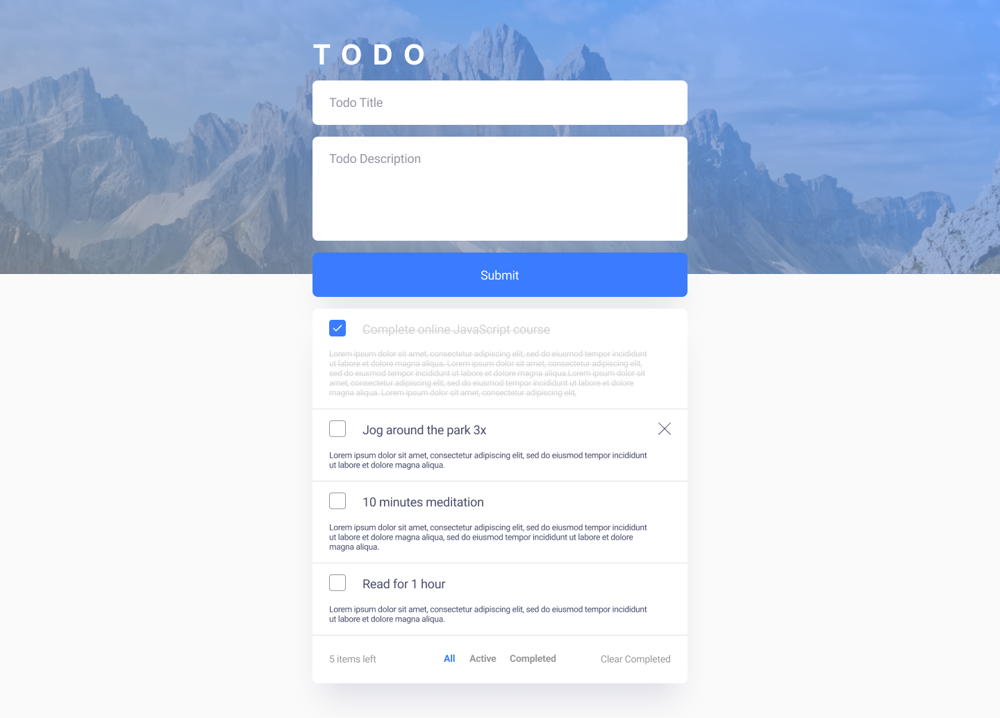
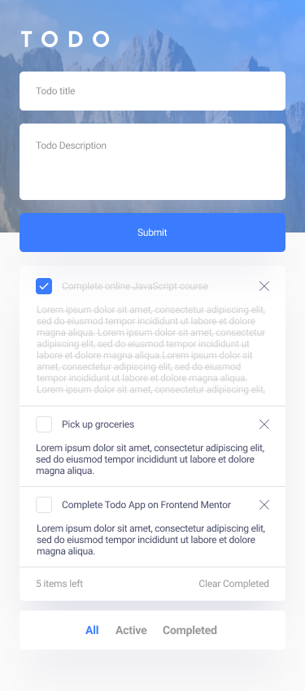

## Installation

Please be careful to follow these steps for installing:

First of all, you must ensure that your node.js version is at least 16 and above.

Then run this command, to install dependencies:

```bash
npm install
```

## Running the app

First, run the development server:

```bash
npm run dev
# or
yarn dev
# or
pnpm dev
# or
bun dev
```

Open [http://localhost:3000](http://localhost:3000) with your browser to see the result.

Then you can add your first todo task to your todo list. So it will be saved on your local storage and whenever you go back to your todo app, you can see it on your list.

If your task get done, you can click on the checkbox to mark it as a completed task.

Or if you regret to do it, you can delete it, with the delete button on the right side.

Also you can see just your active tasks, or completed task with the filters button on the bottom of page.

## Description

This application are designed based on this <a href='https://www.figma.com/file/vFEdFs2T0UOi4tmulkh8JQ/Hajinasiri---todo-app?type=design&node-id=0-1&mode=design&t=jcxUOL2pJtHAOi5u-0' target='_blank'>figma design</a> which is developed and extended by myself.

#### Desktop


#### Mobile

